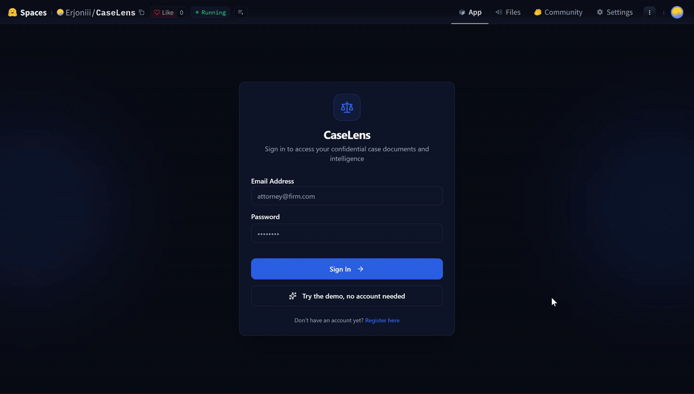

# CaseLens

Question answering over legal contracts. Upload PDFs, text files or scans, ask
a question, and the answer cites the file and page it came from. Answers come
from Gemini or from a local model through Ollama, and each account sees only
its own documents. Retrieval and answers are evaluated on questions built from
CUAD's expert clause annotations.

| | |
|---|---|
| **Live demo** | [Hugging Face Space](https://huggingface.co/spaces/Erjoniii/CaseLens): five CUAD contracts, no account needed |
| **Retrieval** | recall@5 0.702, MRR 0.566 ([report](evals/reports/name-scoped.json)) |
| **Graded answers** | `gemma4:e4b` 20 of 24, Gemini 22 of 24 ([workbook](evals/reports/faithfulness-grading-graded.xlsx)) |
| **Evaluation details** | [evals/README.md](evals/README.md) |

[](https://huggingface.co/spaces/Erjoniii/CaseLens)

## How it works

**Ingestion.** PDF, TXT and image uploads up to 25 MB. PDF pages are read with
pdfplumber, and a page with almost no text is OCR'd with Tesseract at 300 dpi,
one page at a time. A multi-page TIFF becomes one page per frame. Uploads are
indexed one at a time.

**Indexing.** Pages are split into 1000-character chunks with 150 characters
of overlap, embedded with `nomic-embed-text`, and stored in PostgreSQL with
pgvector. Each chunk records the model that embedded it, and a query searches
only chunks from the active model, since vectors from different models are not
comparable.

**Retrieval.** When a question names a document ("the Acme agreement"), the
search is restricted to that document and the name is removed from the query
(see [Name-scoping](#name-scoping)). Users can also select documents; a name
in the question then narrows the selection further. The ten nearest chunks go
to the model.

**Answering.** The model streams an answer that cites filename and page. With
Gemini, a single scoped document under 40k tokens is sent whole instead of as
chunks. With Gemma it is not, because Gemma answered worse from whole
documents.

## Evaluation

The suite calls the same scoping and retrieval code as the API.

- **Corpus:** 69 commercial contracts from [CUAD](https://www.atticusprojectai.org/cuad), 5,574 chunks.
- **Questions:** 100, derived from CUAD's clause annotations, which were
  labelled by law students under attorney supervision. Ground truth is a
  `(filename, page)` pair found by locating the annotated span. CUAD's
  `is_impossible` annotations supply questions about clauses a contract lacks.

| Metric | Dense | Name-scoped (shipped) |
|---|---:|---:|
| recall@5 | 0.340 | 0.702 |
| recall@10 | 0.397 | 0.721 |
| MRR | 0.298 | 0.566 |
| exact_term | 0.419 | 0.790 |
| semantic | 0.321 | 0.750 |
| multi_document | 0.204 | 0.300 |
| latency p50 / p95 | 113ms / 161ms | 96ms / 137ms |

### Name-scoping

`resolve_scope` matches question words against punctuation-stripped filenames
before searching. Each word is weighted by 1 / (number of filenames containing
it), so a party name that appears in one filename outweighs "agreement", which
appears in all 69. Matching is by substring rather than token, because
filenames mix forms like "MERITLIFEINSURANCECO_..." and "Principal Life
Insurance Company - ...", and stemming breaks names ("BloomEnergy" becomes
"bloomenergi"). The search is restricted only when one document wins by a
clear margin.

The matched title is then removed from the query. Left in, it pulled the cover
page into the results: page 1 was in the top 5 for 10 of the 17 misses where
the right document had been found. "When does the Scoutcam agreement become
effective?" is searched within the Scoutcam contract as "When does the become
effective?".

67 of the 74 single-document questions are scoped, none to the wrong contract.
The other 7 name a party with several contracts in the corpus and fall back to
dense search, as does any question that names no document. Every gold question
names its contract, so questions without a name get the dense number, not the
name-scoped one.

With five contracts selected and a question about one of them, searching all
five scored recall@5 0.373. Matching the name within the selection first
scored 0.860, and that is what the app does.

### What did not work

| idea | result | why |
|---|---|---|
| Hybrid lexical search | recall@5 0.126 | the words that identify a contract are in its filename, not its text |
| Cross-encoder reranking | worse, twice | even handed the right contract, web-trained rerankers ordered its pages worse than vector distance |
| Larger embedding models | a trade | Qwen3 gained on paraphrase and lost more on exact terms |
| Fusing two embedders | recall@10 +0.07 | real, but not worth a second 2.5 GB model in memory |
| Whole documents, local model | worse than 10 chunks | a 4B model extracts less reliably from a full contract |
| A regex for declines | precision 0.59 | it cannot tell a supported "no" from an assertion |

### Answers

[`evals/faithfulness.py`](evals/faithfulness.py) grades answers against the
CUAD annotations. 290 answers from `gemma4:e4b` and Gemini were graded:

- On the same 24 questions, Gemma gave 20 good answers and Gemini 22.
- Ten retrieved chunks beat five for both models.
- Whole documents up to 40k tokens helped Gemini, which stopped declining
  questions whose answer was in the text, and hurt Gemma.
- Asked about a clause the contract lacks, both models sometimes answered with
  a related clause instead. One line in the system prompt removed this
  (Gemini 2 to 0, Gemma 1 to 0) without adding wrongful declines.

Declines are graded by a model judge, since a regex cannot tell a supported
"no" from an assertion. The judge agrees with the manual grades on 94% of
good/not-good calls; its calibration is in [evals/README.md](evals/README.md).

## Running it

Requires Python 3.11, Docker, and [Ollama](https://ollama.com).

```bash
ollama pull nomic-embed-text
cp .env.example .env          # set GEMINI_API_KEY for answer generation
pip install -r backend/requirements.lock
docker compose up -d db       # PostgreSQL 16 + pgvector
cd backend ; alembic upgrade head
```

Then the API and the frontend:

```bash
cd backend && uvicorn main:app --reload      # http://localhost:8000/docs
cd frontend && npm install && npm run dev    # http://localhost:3000
```

Only answer generation calls an API. To run fully offline, `ollama pull
gemma4:e4b` and set `LLM_PROVIDER=ollama`. `EMBEDDING_PROVIDER=gemini` embeds
with Gemini instead of Ollama.

### Evaluation

```bash
python -m evals.corpus                      # index evals/corpus/
python -m evals.run --label my-experiment   # report to evals/reports/
python -m evals.faithfulness --cuad path/to/CUAD_v1.json   # answer-level eval
```

[evals/README.md](evals/README.md) covers the gold-set format and how to
reproduce the corpus.

### Deploying

One container holds the frontend, the API, Tesseract, and Ollama with
`nomic-embed-text`, so production uses the same embedder as the evaluation. It
runs as a Hugging Face Space against Postgres with pgvector (Neon's free tier
works), with Gemini answering.

1. Create a Neon project. From your machine, create the schema and seed the
   read-only demo from any folder holding CUAD's PDFs:

   ```bash
   cd backend
   DATABASE_URL="<neon url>" alembic upgrade head
   DATABASE_URL="<neon url>" python seed_demo.py ../evals/corpus
   ```

2. Create a Docker Space. Under *Settings*, add the secrets `DATABASE_URL`,
   `JWT_SECRET` and `GEMINI_API_KEY`, and the variables
   `ENVIRONMENT=production`, `LLM_PROVIDER=gemini` and `REGISTRATION_OPEN=false`.

3. Publish the committed code (git asks for a Hugging Face token with write
   access):

   ```bash
   deploy/huggingface/push.sh <hf-username>/<space-name>
   ```

With registration closed, visitors can only use the demo account, which cannot
upload or delete. All its visitors share `DEMO_DAILY_QUESTIONS` (200) questions
a day, and each question carries at most ten earlier exchanges, which bounds
Gemini spend. If the Space logs warn that `X-Forwarded-For` came from an
untrusted peer, set `TRUSTED_PROXIES` to that network, or all visitors share
one rate-limit bucket.

## Design notes

**Ground truth is a page, never a chunk id.** Chunk ids change with the
chunking configuration, so labels tied to them would break on the first
chunking experiment, and the damage would look like a retrieval change.

**The eval validates its own labels.** A gold entry naming a document that is
not in the corpus fails the run instead of scoring zero, since a mistyped
filename and a real miss look the same once averaged.

**Embeddings default to a local model.** A chunking sweep re-embeds the whole
corpus, which against an API is slow, rate-limited and costly. Vectors are
cached by content hash, so repeated runs embed only what changed.

**The API and the eval share one prompt.** Both import the system prompt and
context formats, so the answer eval measures the prompt that ships.

## Stack

| Layer | Choice |
|---|---|
| API | FastAPI, SQLAlchemy 2, Alembic |
| Database | PostgreSQL 16 with pgvector (untyped `vector`, width per embedding model) |
| Embeddings | `nomic-embed-text` via Ollama, or `gemini-embedding-001` |
| Generation | `gemma4:e4b` via Ollama, or Gemini (`gemini-flash-latest`) |
| OCR | pdfplumber, Tesseract, pdf2image |
| Frontend | Vite, React 19, TypeScript, Tailwind, Radix |
| Auth | bcrypt, PyJWT, Bearer tokens |

## Security

- Passwords are hashed with bcrypt, and an unknown email costs the same check
  as a wrong password. Sessions are signed JWTs sent as a Bearer header; with
  no cookie authentication, a cross-site request cannot authenticate
  (`backend/test_csrf.py`). CORS is pinned to `ALLOWED_ORIGINS`.
- Every document and chunk has an owner, and indexing, retrieval and document
  selection filter on it (cross-tenant tests in `backend/test_e2e.py`).
- Rate limits on auth (10/min) and queries (30/min) are counted in PostgreSQL,
  so they hold across workers. `X-Forwarded-For` is honoured only from
  `TRUSTED_PROXIES` (`backend/test_limits.py`).
- Uploads are extension-allowlisted and filename-validated. A request body over
  the 25 MB cap is refused as it arrives, because the framework parses an
  upload before the endpoint's sign-in check runs.
- A login from an unrecognised device triggers an email alert.

## Known limitations

1. **No vector index.** Retrieval is an exact scan, fast enough at 5,574 chunks
   but not at scale. An HNSW index is the next step once latency matters.
2. **The prompt fix is probabilistic.** For the local model, a second sample of
   the same question again led with the related clause instead of saying the
   clause was missing.
3. **Tokens live in `localStorage`.** That rules out CSRF, but any script
   injected into the page could read them.
4. **The gold set is small and templated.** A change has to move four or five
   answers to clear the noise, and questions that name no document are
   under-represented.

## Next

1. Carry section headings into chunks, then try query rewriting, for the
   remaining misses within a document.
2. A larger gold set, once retrieval stops moving.

Started in May as a ChromaDB and HTMX prototype; rebuilt in September.

## Licence

MIT. CUAD is separately licensed CC BY 4.0 by the Atticus Project.
